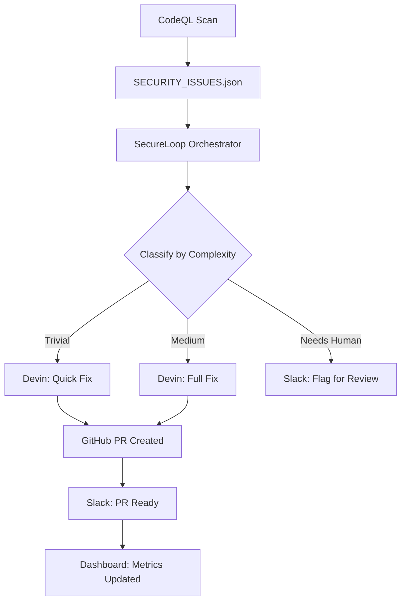

# SecureLoop: Automated Security Remediation Pipeline

Turn CodeQL findings into reviewed PRs — automatically, using Devin.

---

## The Problem

Every company has a security backlog. Your team ran a scan, found critical vulnerabilities — SQL injection, hardcoded secrets, SSRF — and six months later, they're still sitting there. Not because engineers don't care. There's always something more urgent to build. The backlog grows. Compliance risk increases. And every week, you're one breach away from explaining why you didn't fix the things you already knew about.

## How It Works

SecureLoop closes the loop between security findings and engineering fixes:

1. **CodeQL** finds vulnerabilities → stored in `SECURITY_ISSUES.json`
2. **Orchestrator** classifies each issue by complexity (trivial / medium / needs-human)
3. **Devin** receives the issue → writes root-cause fix + tests → creates PR (in parallel)
4. **Slack** notifies your team at each stage
5. **Dashboard** shows real-time metrics (MTTR, fix rate, severity breakdown)

> **Note:** Issues are processed in parallel using ThreadPoolExecutor for maximum throughput.

---

## Architecture



---

## Demo Video

[Link to Loom demo video]

---

## Setup Instructions

### Prerequisites

- Python 3.8+
- Node.js 18+ (for dashboard)
- Devin AI account with GitHub integration
- GitHub repository with write access
- Slack workspace (optional, for notifications)

### Environment Variables

Create a `.env` file in the `secureloop/` directory:

```bash
# Required
DEVIN_API_KEY=your_devin_api_key

# Optional (for GitHub operations)
GITHUB_TOKEN=your_github_token

# Optional (for Slack notifications)
SLACK_WEBHOOK_URL=your_slack_webhook_url
```

See `.env.example` for all available options.

### Installation

```bash
# Install Python dependencies
cd secureloop
pip install -r requirements.txt

# Install dashboard dependencies (optional)
cd dashboard
npm install
```

---

## Usage

### Run the Full Pipeline

Process all security issues:

```bash
cd secureloop
python run_full_pipeline.py
```

### Process a Subset

```bash
# Process first 3 issues
python run_full_pipeline.py --limit 3

# Process specific issues
python run_full_pipeline.py --issue-ids SEC-2025-1142 SEC-2025-1143
```

### Test a Single Issue

```bash
cd secureloop
python test_single_session.py --issue-id SEC-2025-1142
```

### Start the Dashboard

```bash
cd secureloop/dashboard
npm start
```

Dashboard runs at `http://localhost:3000`

---

## Example Output

Real PR created by SecureLoop:  
https://github.com/SatyamDave/takehome-medsecure/pull/1

---

## Built With

- **Python 3.8+** — Orchestrator logic
- **Devin AI** — Autonomous code remediation
- **GitHub API** — PR creation and branch management
- **Slack API** — Pipeline notifications
- **React** — Dashboard frontend
- **Flask** — Demo target application

---

## License

MIT
